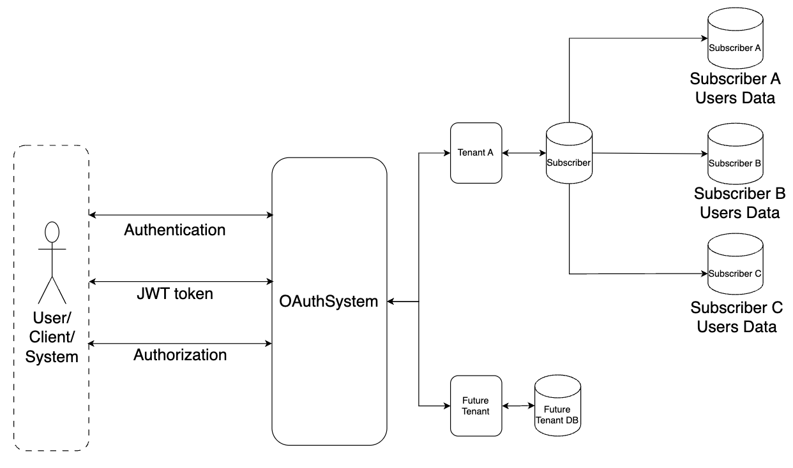

# OAuthSystem 

## Motivation: 
### *What and Why?*

This project is driven by two primary motivations:

- **Personal Growth**: To enhance my skills and knowledge in various areas, including:
    - **Spring Boot Framework**: Gaining hands-on experience with this powerful framework.
    - **Database Solutions**: Evaluating and selecting the appropriate database technologies for different use cases.
    - **Security**: Implementing robust security practices.
    - **Scalability**: Designing systems that can efficiently scale with increased demand.
    - **Observability**: Incorporating effective monitoring and logging practices.
    - **Many More**: Additional learning and insights will be documented in the Technologies Used section.

- **Professional Development**: Develop a flexible OAuthsystem that can be configured by its consumers to meet their specific needs. I will be defining phase to capture the scope and progress of the project.
- Authentication and Authorization should always be isolated and centralized as a single point of control. To embrace this principle, I am undertaking this project.
---

## Project:
### *What?*
#### High Level Design
